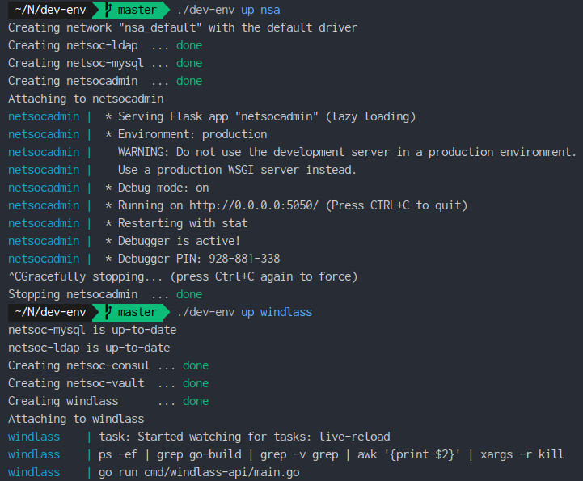

This was originally written for UCC Netsoc, which can be found [here](https://blog.netsoc.co/creating-a-dockerized-development-environment/),
with some minor edits.

---

Docker and containers are all the rage these days. People are coming up with all sorts of things to do with Docker, and local development environments are no exception.

Taking a page out of the book from [Teamwork](https://teamwork.com) (where I did my placement), I decided to incorporate my spin on their style of docker-compose based development environments for Netsoc, and not just for the committee 
but for our members too. You can see the current progress [here](https://github.com/UCCNetworkingSociety/dev-env/). Do note that this is a very opinionated take on it, trading shorter commands, less file copying and more DRY docker-compose files for some flexibility.

## Backing Services

The concept of strict distinction between **backing services** and normal **services** was taken from [The 12 Factor App](https://12factor.net), introduced to me at Teamwork by SysOps member Mark O'Connor.

In short, backing services should be treated as resources attached to your application, any resource that your application consumes over the network such as databases, message queues etc. Your application should make no distinction between local or 3rd party backing services. The resource handle should be changable without changing the source code and the app will work as normal.

## Dev Env Architecture

The architecture for the developer environment is very simple. Each service has its own `docker-compose.yml` that specifies the usual things like image, ports as well as what backing services it relies on. These backing services are all defined in `backing-services/docker-compose.yml`. This lets us keep our definitions of the backing services adhering to the DRY principle.

```
│── dev-env
├── backing-services
│   │── docker-compose.yml
│   │── docker-compose.override.yml
│   │── mysql
│   │   └─⋯
│   ├── auth
│   │   └─⋯
│   └─⋯
├── nsa
│   │── docker-compose.yml
│   └── docker-compose.override.yml
├── windlass
│   │── docker-compose.yml
│   └── docker-compose.override.yml
└──⋯
```

Below we can see the `docker-compose.yml` and my local `docker-compose.override.yml` for Windlass. The latter has been setup to allow for live-reload of code.

Important to note is the volume mount. Each dev-env tagged image should contain the source code for the service. Using the volume mount, we can override the code in the container with our own code locally on our machine. This way, we can make changes to the code in our own filesystem in our editor and it will be reflected in the container. As a further example, using the below docker-compose files, if we make a change to the Windlass repo we have cloned, Windlass will reload in the container and will reflect the changes we have made in the editor.

`windlass/docker-compose.yml`:

```yaml
version: '3.7'
services:
  windlass:
    image: docker.netsoc.co/public/windlass:dev-env
    container_name: windlass
    volumes:
      - /var/lib/lxd/unix.socket:/var/lib/lxd/unix.socket:ro
    ports:
      - '5051:8080'
    depends_on:
      - db
      - auth
      - consul
      - vault
```

All very standard; specifying the image, the container name, mounting the LXD Unix socket, mapping ports and specifying the dependencies.

`windlass/docker-compose.override.yml`:

```yaml
version: '3.7'
services:
  windlass:
    command: 'task live-reload -w'
    security_opt:
      - 'seccomp:unconfined'
    ports:
      - '3456:3456'
    volumes:
      - /home/noah/Netsoc/Windlass:/windlass
```

Here we override the command from the default `go run cmd/windlass-api/main.go` to give us live reload support. For this to work properly, we also need to map our local code into the container.
An extra port mapping and security option are set for if we want to change the command to `task debug -w`, to allow us to debug from within the container from the comfort of our own editor! How fancy is that.

### The magic script

At the heart of the Netsoc Dev-Env is a single, short bash script, which at the time of writing looks like the following:

```bash
#!/bin/bash

docker-compose $(find . -name 'docker-compose.*yml' | xargs -n 1 echo '-f' | xargs echo) ${@:1}
```

As you can pass multiple docker-compose files to the docker-compose command, we leverage that in the script. It finds all `docker-compose.yml` and `docker-compose.override.yml` files, prefixes them with `-f` and returns them as one long string. This gets passed to `docker-compose` and any other args (such as `up` etc) are passed to `docker-compose` as well. For example, `./dev-env up windlass` will run the following command:

```bash
docker-compose -f ./nsa/docker-compose.yml -f ./nsa/docker-compose.override.yml -f ./windlass/docker-compose.yml -f ./windlass/docker-compose.override.yml -f ./backing-services/docker-compose.yml -f ./backing-services/docker-compose.override.yml up windlass
```

Below we can see the results of starting Netsoc Admin, stopping it and starting Windlass. As all docker-compose files are referenced under one "logical namespace" in the command, common backing service containers can be shared rather than having a `netsoc-mysql` for Netsoc Admin and another one for Windlass (which would cause name conflicts). This single namespace may not suit everyones docker-compose based dev-env needs, but its sufficient for our requirements.



### Preprepared Backing Services

Some backing services, including MySQL, need prior work to be able to work out of the box. The goal is that, in the words of the great Todd Howard:


For this to be the case, we create a folder in `./backing-services` for each backing service that needs a lil helping hand to please Todd. Taking MySQL as an example, we have a simple Dockerfile along with an SQL file to create and populate the necessary tables. This is why the docker-compose service for MySQL uses a custom image from us, as it comes preprepared with the necessary tables and users.

## It Just Works™

A simple and unobstrusive developer environment is key for every good developer experience. It should work out of the box and let the developer get on with his or her coding without much thought. Docker-compose based developer environments may be the next step after Vagrant based developer environments, without the overhead of running a whole virtual machine.  Lighter, simpler to understand and faster to tear up and down, docker-compose was an obvious choice for the Netsoc Dev Env to replace the old Vagrant based one. Of course, this type of setup may not work for everyone. If you deploy to Kubernetes, something MiniKube based will probably be more applicable. But for Docker Swarm or even no orchestrator, docker-compose based dev-env makes a valuable utility.
